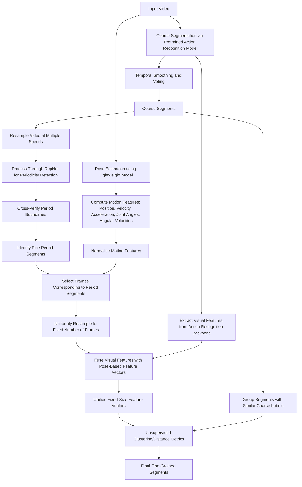

# Paper

## Title:
**Class-Agnostic Action Segmentation in Construction Videos Based on Periodicity and Pose Dynamics: A Preliminary Study**

## Abstract:
Monitoring construction activities is essential for ensuring safety and quality on job sites. However, accurately segmenting continuous worker actions from video data is challenging due to the variability in human motion and the scarcity of annotated data. In this work, we propose a prototype framework that first obtains a coarse segmentation of construction activities and then refines these segments by leveraging periodicity detection and pose-based motion analysis. Our approach extracts action cues from video sequences and computes motion features that capture dynamics such as movement speed and joint behavior. These features are fused and grouped into context-aware action segments, enabling the differentiation of similar low-level actions across various tasks (e.g., distinguishing “holding” during masonry from that during plastering). Preliminary experiments using unsupervised clustering (k-means) lead to suboptimal segmentation granularity, prompting us to explore alternative clustering strategies. Further development and experiments are underway to enhance segmentation accuracy.

## Pipeline:

